<picture>
  <source media="(prefers-color-scheme: dark)" srcset="./dark.svg">
  <source media="(prefers-color-scheme: light)" srcset="./light.svg">
  
</picture>

<h1 align="center">Hi, I'm Karthik 👋</h1>

  

  

  

  <i>Building projects that solve real-world problems 🚀</i>

---

## 🚀 About Me

- 🎓 Computer Science Student
- 💻 Interested in Full Stack Development
- 🤖 Exploring AI & Machine Learning
- 🔥 Building real-world projects
- 🌱 Always learning and experimenting
- 🧠 Interested in solving practical problems with technology

---

## ⚡ Tech Stack

---

## 📊 GitHub Statistics

---

## 🔥 Contribution Streak

---

## 🐍 Contribution Activity

<picture>
  <source media="(prefers-color-scheme: dark)" srcset="https://raw.githubusercontent.com/karthikh7889/karthikh7889/output/github-contribution-grid-snake-dark.svg">
  <source media="(prefers-color-scheme: light)" srcset="https://raw.githubusercontent.com/karthikh7889/karthikh7889/output/github-contribution-grid-snake.svg">
  
</picture>

---

## 🌐 Connect With Me

## 🚀 Currently Building

💻 Full Stack Web Applications  
🤖 AI & Machine Learning Projects  
⚡ Real-World Problem Solving  
🌐 Modern Web Technologies

---

## 🏆 GitHub Trophies

---

## 📈 My Goals

Learn → Build → Experiment → Solve → Improve 🚀

---

### 🚀 Keep Building. Keep Learning. Keep Growing.

<i>"Turning ideas into projects, and projects into experience."</i>

  

